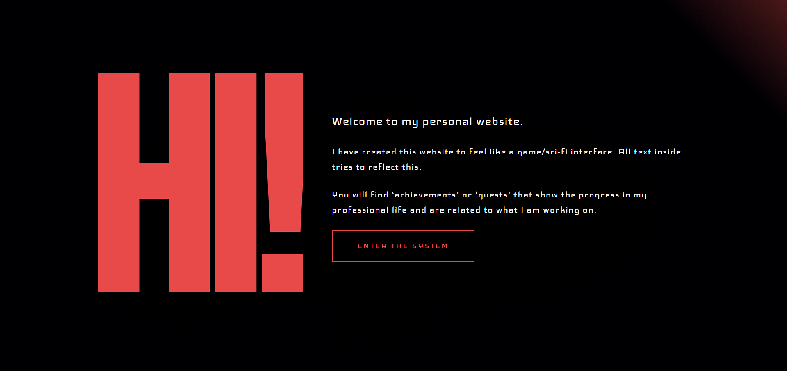
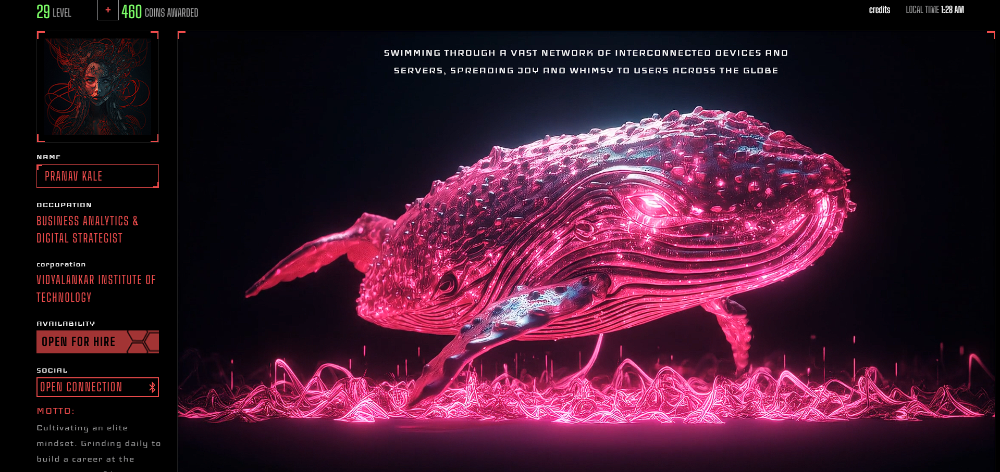

# Pranav Kale | Digital Strategist & Full-Stack Developer Portfolio

Welcome to the open-source repository for my personal portfolio. I am a Computer Engineering student at Vidyalankar Institute of Technology, specializing in the intersection of artificial intelligence, business analytics, and digital strategy.

**🔴 Live Site:** [https://portfolio-peach-two-j87fvnar5n.vercel.app/]

## 📸 Sneak Peek




## 🚀 About This Project
This portfolio was built to showcase my technical engineering execution and overarching business goals. It features a cyberpunk-inspired, interactive 3D UI that highlights my elite mindset, daily grind, and professional milestones.

### Core Features
* **Agent-Themed UI:** Highly interactive, neon-styled interface with modal-based navigation.
* **Integrated Contact System:** Fully functional client-side contact form routed directly to my inbox without needing a backend server.
* **Responsive Design:** Fluid layouts that scale seamlessly from desktop to mobile.

## 🛠️ Tech Stack
* **Frontend:** React.js (v19), Vite
* **Styling & Animation:** Tailwind CSS, Framer Motion
* **Routing:** React Router DOM
* **Email Service:** EmailJS
* **Deployment:** Vercel

## 📂 Featured Projects Highlighted
1. **EV-RIT Platform:** A full-stack electric vehicle marketplace (Next.js, Streamlit, Supabase).
2. **AI Resume Parser:** An NLP pipeline to automate recruitment data processing.
3. **AI Toll Booth Traffic Monitor:** A computer vision prototype for traffic density analysis (OpenCV, YOLO).

## 💻 Local Installation
If you want to run this project locally, follow these steps:

1. Clone the repository:
   ```bash
   git clone [https://github.com/Pranav260804/pranav-portfolio.git](https://github.com/Pranav260804/pranav-portfolio.git)
